| Picture | Tools | Link / Command | File Facts |
| :--- | :--- | :--- | :--- |
| **Ocean.jpg** | `exiftool` | [https://exif.tools/](https://exif.tools/) | 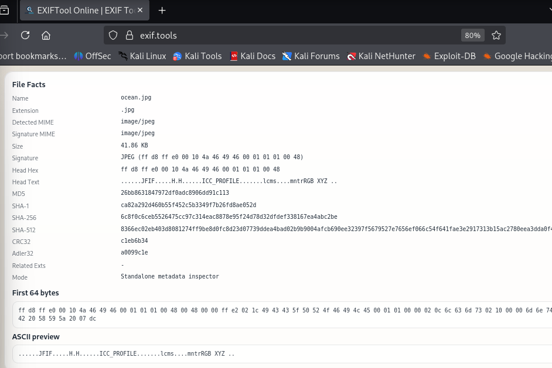 |
| | | `exiftool ocean.jpg` | 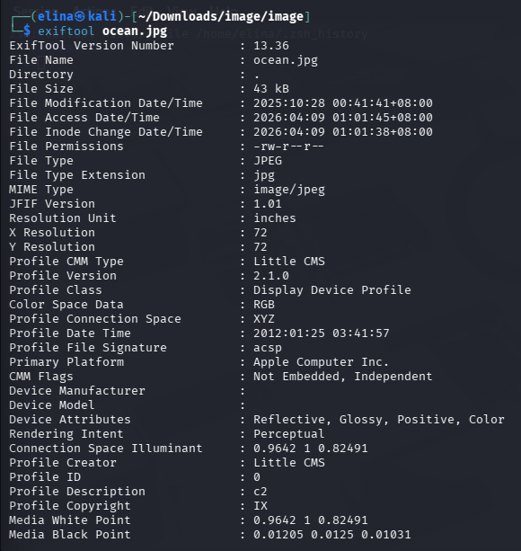 |
| **Computer.jpg** | `Hexeditor` | [https://hexed.it/](https://hexed.it/) | 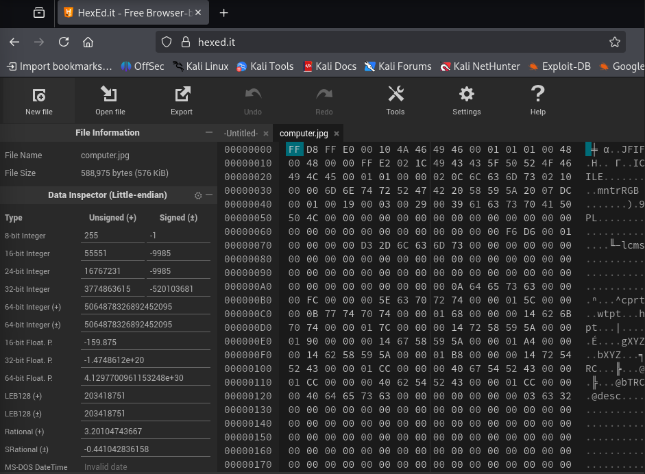 |
| | | `hexeditor computer.jpg` | 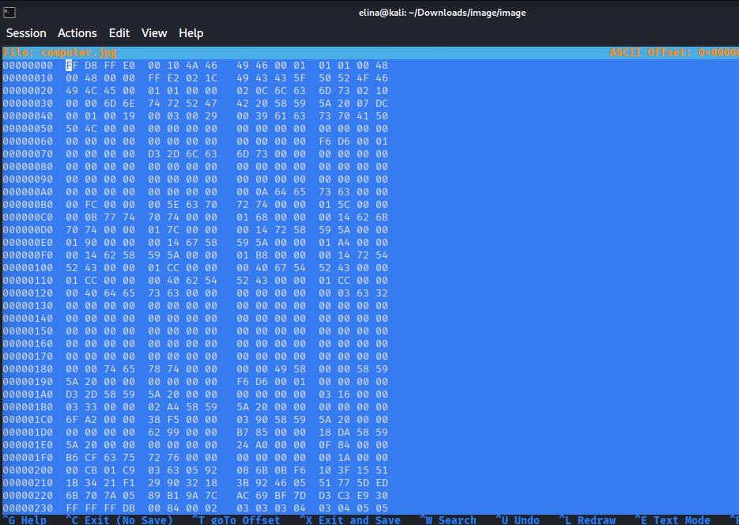 |
| **Dog.jpg** | `binwalk` | `binwalk dog.jpg` | 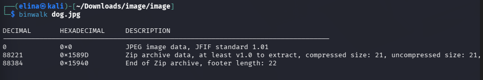 |
| | | `binwalk -e dog.jpg` | 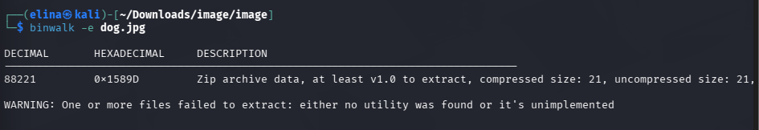 |
| | | `cd _dog.jpg.extracted/` | 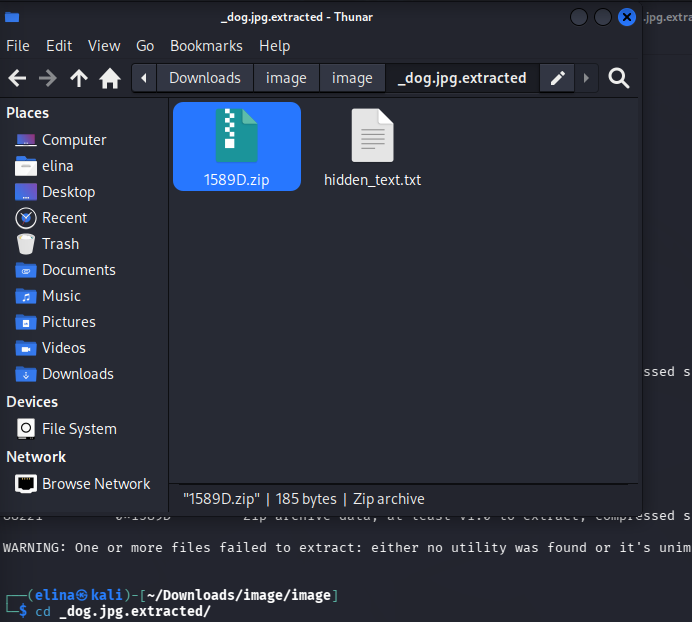 |
| | | |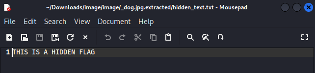 |
| **Computer.jpg** | `Strings` | [https://www.dcode.fr/strings-extractor](https://www.dcode.fr/strings-extractor) | 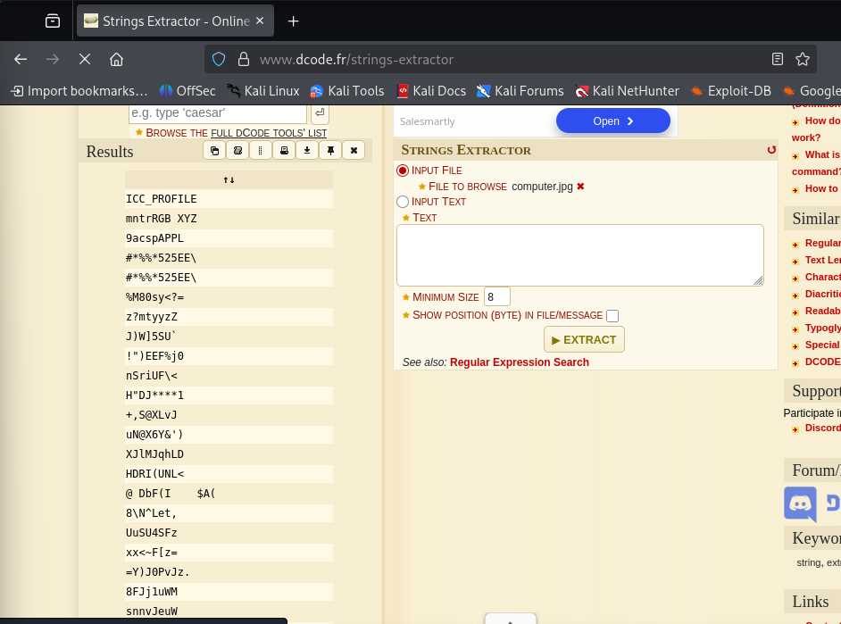 |
| | | `strings computer.jpg` | 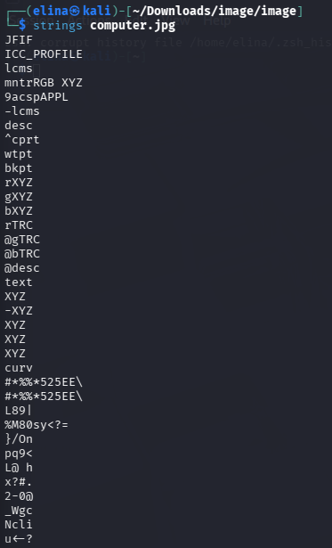 |
| **Solitaire.exe** | `file (Check File)` | `file solitaire.exe ` | 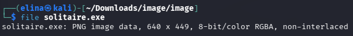 |
| **Rubiks.exe** | `file (Check File)` | `file rubiks.exe` | 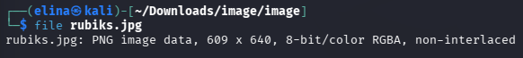 |
